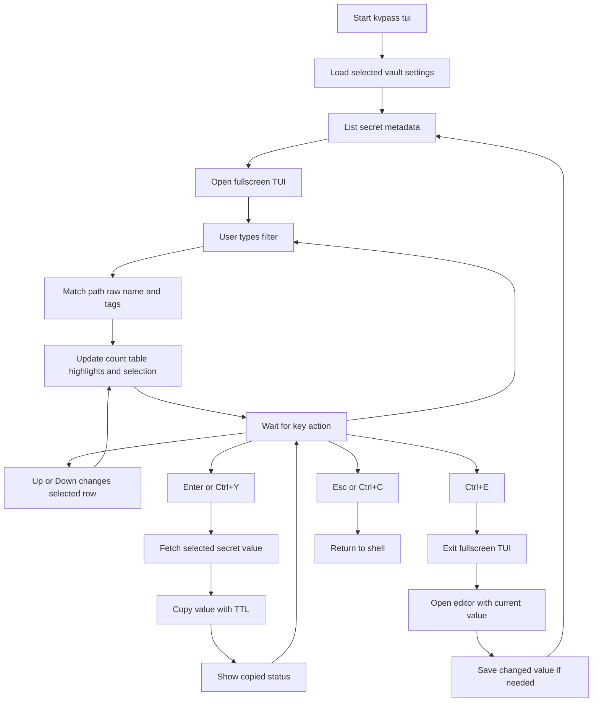

# kvpass TUI Flow

```mermaid
flowchart TD
    Start[Start kvpass tui] --> LoadConfig[Load selected vault settings]
    LoadConfig --> LoadSecrets[List secret metadata]
    LoadSecrets --> OpenTui[Open fullscreen TUI]
    OpenTui --> Filter[User types filter]
    Filter --> Match[Match path raw name and tags]
    Match --> Update[Update count table highlights and selection]
    Update --> Wait[Wait for key action]
    Wait --> Filter
    Wait --> Move[Up or Down changes selected row]
    Move --> Update
    Wait --> Copy[Enter or Ctrl+Y]
    Copy --> FetchValue[Fetch selected secret value]
    FetchValue --> Clipboard[Copy value with TTL]
    Clipboard --> Status[Show copied status]
    Status --> Wait
    Wait --> Edit[Ctrl+E]
    Edit --> ExitTui[Exit fullscreen TUI]
    ExitTui --> Editor[Open editor with current value]
    Editor --> Save[Save changed value if needed]
    Save --> LoadSecrets
    Wait --> Quit[Esc or Ctrl+C]
    Quit --> End[Return to shell]
```
